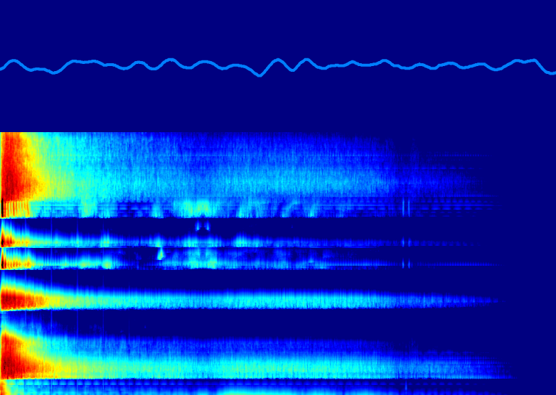

# audiovisualizer

a small tool to render spectrograms (waterfall graphs) or waveforms from audio in your browser



[Demo 1 (standard config using microphone)](https://toolset.io/audiovisualizer/examples/waveandwater.html)

[Demo 2 (showing different config possibilities with audio tracks)](https://toolset.io/audiovisualizer/examples/customized.html)

### npm

```npm install @fjw/audiovisualizer```

### Getting started

Initialise the AudioVisualizer object:

```new AudioVisualizer({options});```

### Example
```js
new AudioVisualizer({ // no src, uses the microphone
    v: [
        {
            type: "spectrum",
            container: "#myspectrum"
        },

        {
            type: "waveform",
            container: "#mywaveform"
        }
    ]
});
```

### required options

- ```v``` an array of visualizations, each with individual options
- ```v.type``` the type of the visualization, possible values are ```waveform``` and ```spectrum```
- ```v.container``` the css selector of the container (HTMLElement) where the canvas gets rendered in,
if the container is resized, the canvas will be resized, too.

### optional options

- ```src``` URL of audio file/stream. skip to use microphone as source
- ```muted``` start muted or with hearable audio (default: true)
- ```analyser``` object with additional options for the analyser (see [AnalyserNode (Mozilla Docs)](https://developer.mozilla.org/en-US/docs/Web/API/AnalyserNode/AnalyserNode))
for example ```analyser.fftSize: 4096``` increases the resolution (standard is 2048) 

- ```v.background``` background color

#### waveform only
- ```v.lineWidth``` width of the line
- ```v.strokeStyle``` strokeStyle (color) of the line

#### spectrum only
- ```v.rowsPerSec``` speed of the waterfall
- ```v.colortheme``` array of colors for the gradients (see [examples](./examples/customized.js))

### methods

- ```mute()``` mutes the audio
- ```unmute()``` unmutes the audio
- ```setSource(url)``` sets a new audiosource (false/null/undefined = microphone)